# slack\_bot
立志成为一个可被调戏且有用的Bot

### 介绍

很多人听过甚至曾经用过[小黄鸡](https://github.com/wong2/xiaohuangji-new). 你可以把本bot理解为`增加了很多功能`, `只保留小黄鸡交流的基本逻辑`,
`用于slack`channel里面的`小黄鸡`. 它主要借用slack的[Outgoing Webhooks](https://api.slack.com/outgoing-webhooks),
也使用了[私聊](https://api.slack.com/methods/chat.postMessage)和[upload](https://api.slack.com/methods/files.upload).

项目使用flask, 目前本项目是一个heroku应用. 地址是 https://slack-bot2.herokuapp.com/slack_callback 但是你也可以直接裸跑

```python
gunicorn wsgi:app localhost:5000 --timeout 240 --log-file -
```

### 我们使用slack的特性

1. 可以把消息私聊发给自己
2. 可以使用带图的方式接收结果(支持canvas, 以下会看到例图)

### 模块用途

继承自小黄鸡的模块们, 但是都做了对应的修改:

1. 空气插件
2. wikipedia
3. 地震了
4. 糗百
5. orz

新加的模块们:

#### 地图插件 - 你可以输入我想从哪去哪, 会给你个路线(步行/开车/公交)
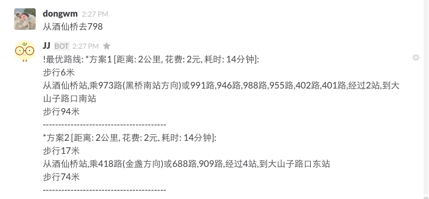
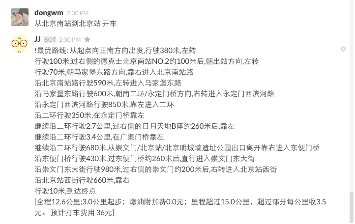

#### 天气插件 - 使用了百度api, 获得城市的天气情况
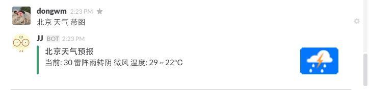

#### 北京公交插件 - 可以查询北京公交线路, 获取实时的到某站的信息(有些线路站点不准)
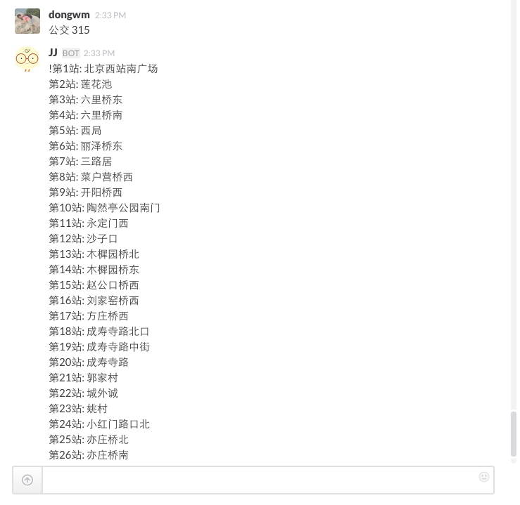
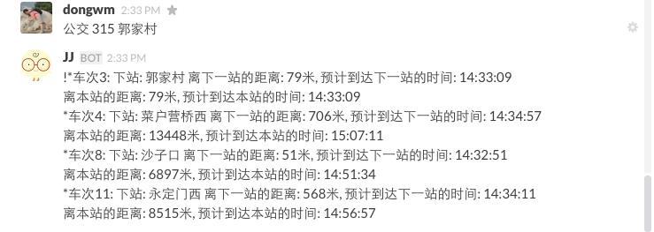

#### 美食插件 - 使用大众点评网api, 获取附近餐饮信息, 评分, 电话地址,距离等等


#### 技术活动插件 - 从segmentfault/csdn/车库咖啡/活动行获得最近的活动列表
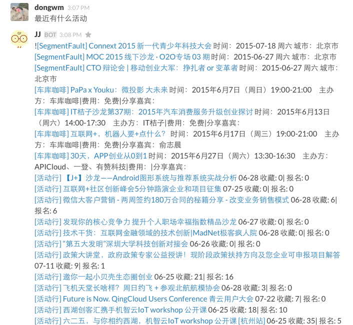

#### Github\_issue插件 - 获得你个人或者组织下未处理的Pull requests列表
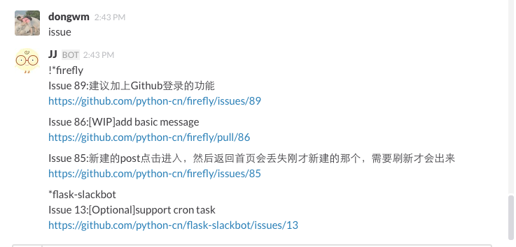

#### 电影信息插件 - 列出最近上映和即将上映的电影信息
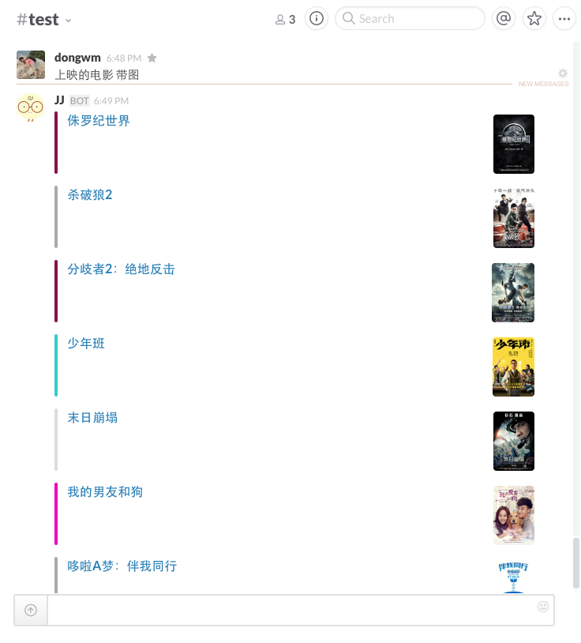

#### pycoders插件 - 获得<pycoders weekly>订阅数据
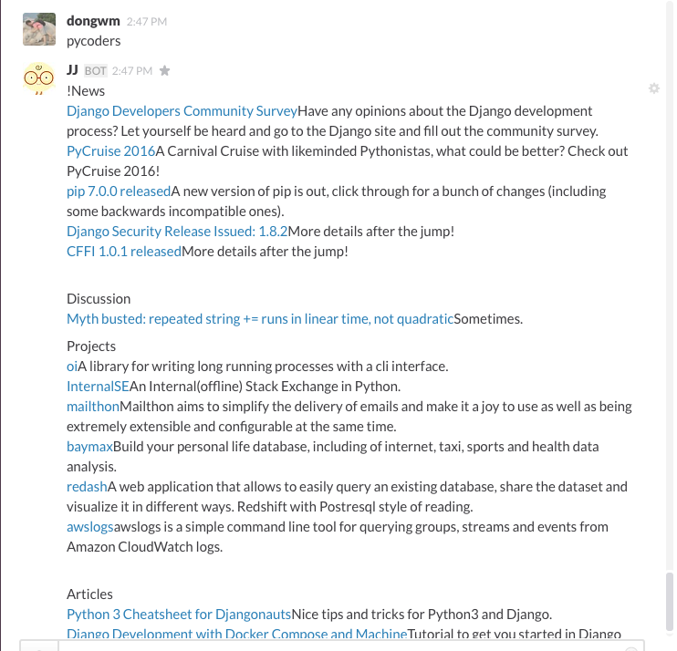

#### pythonweekly插件 - 获得<pythonweekly>订阅数据
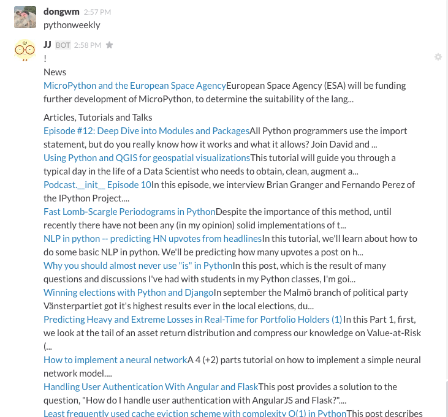

#### 头条插件 - 获得今日头条新闻


#### travel插件 - 旅游推荐/景点介绍
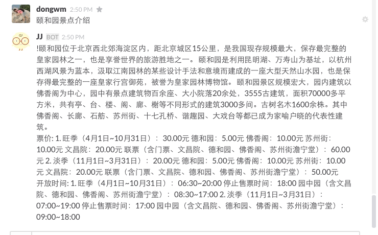


#### v2ex feed插件 - 获得一些节点的最新feed
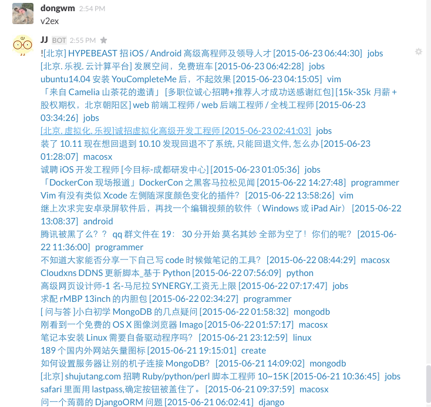

#### help插件 - 列出所有插件的帮助信息
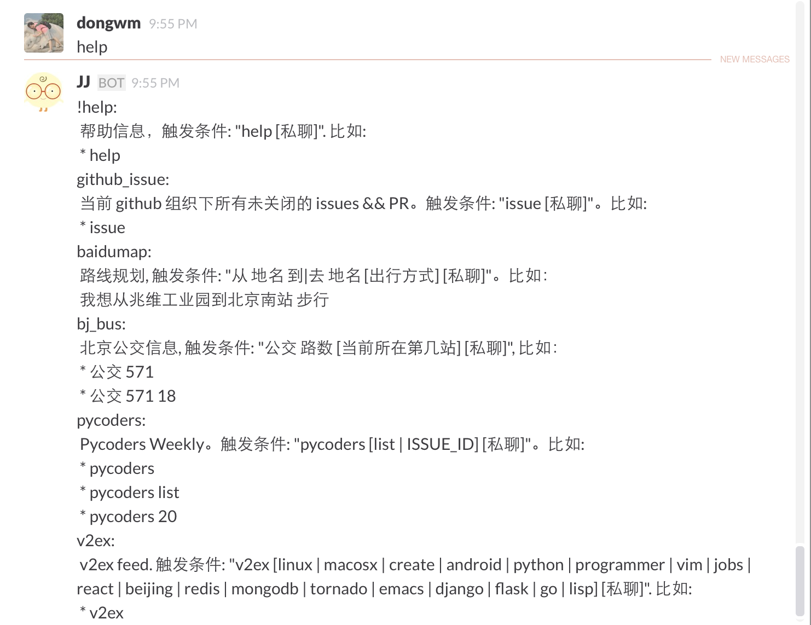

#### 最主要的是小黄鸡(simsim)
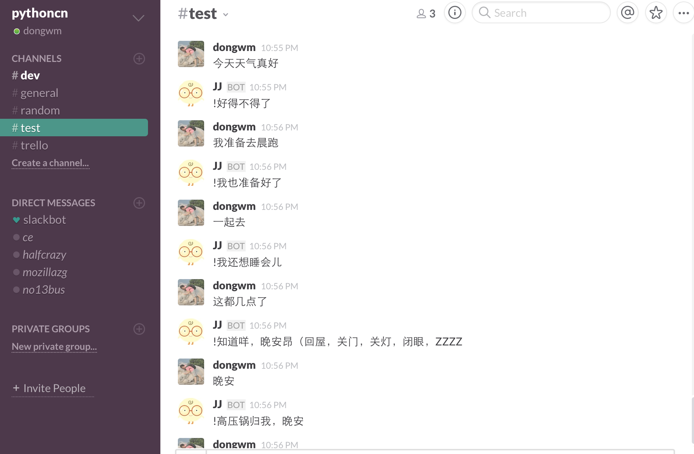

#### 也可以直接发到个人的slackbot channel里:

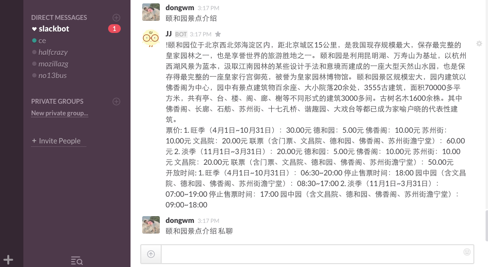
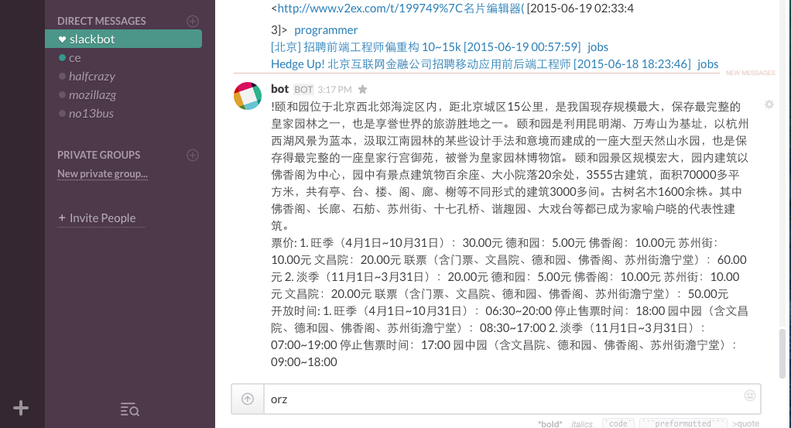

### 提交pull request

我们欢迎你把你想要的idea实现出来, 或者在看过本项目代码后用于个人以及私有公司的插件遇到bug, 发现瓶颈等时候
给我们PR

### 插件编写

插件放在plugins目录下，每个插件是一个python文件，提供两个接口，`test`和`handle`，格式如下：

```python
def test(data):
   // your code
```

`test`方法返回`True`或`False`，说明是否要用该插件处理这一条请求


```python
def handle(data, **kwargs):
    // your code
```

`handle`方法则实际处理请求，它需要返回一个utf-8编码的字符串或者一个tuple，用来作为小黄鸡对这条请求的答复:

1. 返回只包含一个字符串表示不支持带图模式
2. 返回一个(字符串, 一个attachment的列表), 每个attachment可以使用plugins/utils.py的 `gen_attachment` 生成

`data` 是一个dict, 它是slack在回调的时候的请求, 一般情况下你只需要关注`data['message']`这个`消息全文`字段.

注意事项:

1. 请把新的插件的名字也加在plugins/\_\_init\_\_.py的 `__all__` 里面
2. 如果其他插件都不符合, 会默认使用小黄鸡接口
3. 本地调试可以使用这样的http请求:

    ```
    http -f POST http://localhost:5000/slack_callback token=jLGMzrZn3P1lS2sD848KpPuN text='颐和园景点介绍' team_id=T0001 team_domain=example channel_id=C2147483705 channel_name=test timestamp=1355517523.000005 user_id=U2147483697 user_name=Steve trigger_word=''
    ```

4. 你也可以这样调试:

    ```
    $python manage.py send 今天天气很不错
    !是啊是啊  好想出去玩
    ```

### TODO

- [ ] 输入xx有什么可玩的
- [ ] 今天中午吃什么

- [x] 输入我想从哪去哪, 调用地图api.给个路线
- [x] 附近有什么可吃的(大众点评)
- [x] 最近都有神马技术聚会
- [x] Pycoders Weekly & Python Weekly 汇总
- [x] 今日头条
- [x] 公交车离我还有多久/远
- [x] v2ex feed
- [x] github上的issue列表
- [x] 最近(将)上映的电影(豆瓣电影)
- [x] 旅游路线推荐/景点介绍


### Pending

1. 打车
2. 叫快递
3. 叫外卖
